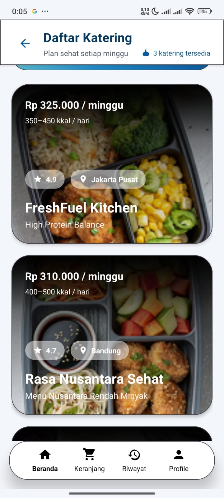

# 🥗 NutriCycle

<div align="center">


**Sustainable Healthy Catering & Nutrition Tracker App**

[](https://developer.android.com/)
[](https://kotlinlang.org/)
[](https://go.dev/)
[]()

</div>

---

## 📖 Project Overview

**NutriCycle** adalah aplikasi mobile yang mengintegrasikan layanan pemesanan katering sehat dengan pelacakan nutrisi harian. Proyek ini dibangun dengan fokus pada **Clean UI** dan pengalaman pengguna yang seamless, membantu pengguna menjaga pola makan sehat sekaligus mendukung gaya hidup ramah lingkungan.

---

## 📱 App Modules & Screens

Aplikasi ini terdiri dari 5 modul antarmuka utama yang telah dikembangkan:

### 1. Home Dashboard (`Home Page`)
Pusat navigasi utama dengan desain *clean*. Menampilkan ringkasan status pengguna, promo harian, dan akses cepat ke kategori katering favorit.

### 2. Catering Marketplace (`Catering List`)
Halaman eksplorasi yang menampilkan daftar mitra katering. Dilengkapi dengan *cards* informatif yang memuat rating, lokasi, dan kisaran harga/kalori tanpa tampilan yang berantakan (cluttered).

### 3. Product Detail (`Catering Detail`)
Halaman detail yang *immersive*. Memberikan informasi mendalam mengenai menu mingguan, komposisi bahan, serta breakdown makronutrisi dari setiap paket katering.

### 4. Nutrition Tracker (`Gizi Meter`)
Fitur unggulan untuk memantau asupan nutrisi harian. Visualisasi data konsumsi kalori, protein, dan lemak pengguna dalam tampilan grafik yang mudah dipahami.

### 5. User Hub (`Profile`)
Halaman personalisasi pengguna untuk mengatur preferensi diet (vegan/low-carb), alamat pengiriman, dan riwayat pesanan.

---

## 📸 UI Gallery

<div align="center">
  
  
  
</div>
<div align="center">
  
  
  
</div>

---

## 🛠️ Technical Architecture

### Android Client
* **Language:** Kotlin
* **UI Layout:** XML (ConstraintLayout, NestedScrollView, Material Components)
* **Design Pattern:** MVVM (Model-View-ViewModel)

### Backend Services (Learning Roadmap)
* **Core API:** Go (Golang) with Gin/Fiber Framework
* **Database:** MySQL
* **Features:** REST API untuk manajemen user dan data katering.

---

## 📂 Project Structure

Struktur direktori proyek disusun untuk skalabilitas (Scalability) dan keterbacaan (Readability):

```text
NutriCycle/
├── app/src/main/
│   ├── java/com/candrawijaya/nutricycle/
│   │   ├── data/            # Repository & Models
│   │   ├── ui/
│   │   │   ├── home/        # HomeFragment & ViewModel
│   │   │   ├── catering/    # List & Detail Logic
│   │   │   ├── tracker/     # Gizi Meter Logic
│   │   │   └── profile/     # Profile Logic
│   │   └── utils/           # Helper classes
│   └── res/
│       ├── layout/          # XML Layouts (activity_main, fragment_home, etc)
│       └── drawable/        # Assets & Custom Shapes
└── README.md
